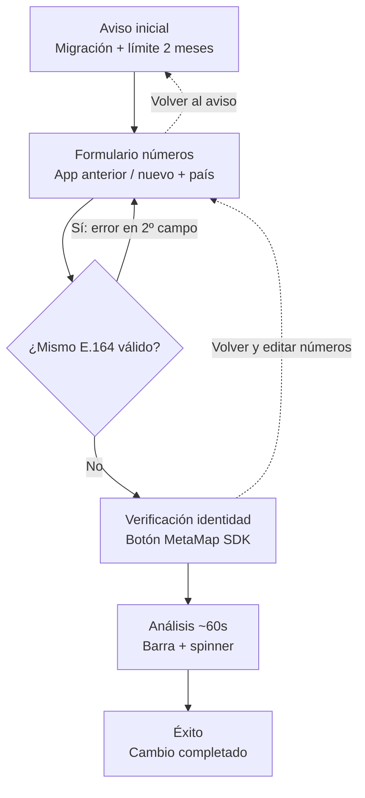

# Handoff diseño / Figma — Cambio de perfil Punto Pago

Este documento describe el **flujo**, **pantallas** y **tokens** del proyecto en código. **No sustituye un archivo `.fig`**: en Figma verás lo mismo que en la app solo si **reconstruís los frames** con estos datos o si **pegás capturas** de la URL desplegada (Vercel) como referencia visual.

## ¿Coincide pixel a pixel con Figma?

- **La fuente de verdad visual es la web** (Next.js + Tailwind en este repo).
- Figma mostrará el mismo diseño **después** de que alguien lo dibuje siguiendo esta guía, o si importás **screenshots** del sitio real como capa de referencia (bloqueada al 100% de ancho móvil, p. ej. 390px).

## Flujo (diagrama)

Copiá el bloque en [Mermaid Live](https://mermaid.live) → exportar SVG/PNG → pegar en FigJam o Figma.

## Vistas en la app

| Ruta | Qué muestra |
|------|-------------|
| `/` | Flujo completo dentro de **PpAppChrome** (header Punto Pago + footer). |
| `/embed` | Misma tarjeta de flujo, **compacta**, sin chrome; query opcional `?label=`. |
| `/widget` | Redirección 301 → `/embed`. |

## Frames sugeridos en Figma (nombres)

1. `01 - Aviso` — Título, caja ámbar (migración), caja gris (2 meses), CTA primario.
2. `02 - Números` — Dos bloques país + tel; gancho verde si formato OK; segundo campo en rojo si duplicado.
3. `03 - MetaMap` — Un solo título “Verificación de identidad”, párrafo con E.164 + documento/selfie, CTA ancho completo.
4. `04 - Analizando` — Título, texto con números, barra de progreso 60s, spinner, leyenda “No cierres…”.
5. `05 - Completado` — Icono éxito, mensaje, línea `E.164 → E.164` con posible quiebre de línea.

**Variantes:** frame duplicado “Embed / móvil 390” sin header/footer, solo tarjeta sobre fondo `#f4f5fb` + orbes opcionales (decorativo).

## Tokens (desde `globals.css` / Tailwind)

| Token | Valor / uso |
|-------|-------------|
| Fondo página / surface | `#f4f5fb` |
| Texto principal | `#0B0B13` |
| Marca (gradiente CTA) | `#4749B6` → `#3B3DA6` |
| Tipografía UI | Plus Jakarta Sans (Google Font en `layout.tsx`) |
| Monoespaciado | Geist Mono — números E.164 |
| Tarjeta | Blanco ~90% opacidad, borde blanco suave, `rounded-2xl`, sombra suave |
| Éxito | Verde esmeralda (badges / ícono check) |
| Error duplicado | Borde/ring rojo en campo “app nuevo” |

## Comportamiento móvil (para anotar en Figma)

- **Safe area:** notch / home indicator — contenido con márgenes `safe-area-inset-*` (ver `pp-app-chrome` y `/embed`).
- **Touch:** botones ~**48px** alto mínimo; `touch-action: manipulation`.
- **Inputs:** **16px** en número de app para evitar zoom al enfocar en iOS (clase `.pp-input-mobile`).
- País + número en **columna** en viewport estrecho; **fila** desde `sm`.

## Eventos útiles (para notas en Figma / dev)

Documentación detallada: `src/lib/cambio-perfil-parent-events.ts`.

Punto clave backend: `metamap_verification_submitted` (tras SDK MetaMap, antes de la barra de 60s).

## Cómo alinear Figma con la web rápido

1. Abrí la URL de **producción o preview** en Chrome.
2. Activá **Dimensions: iPhone 14** (o 390×844).
3. Capturá cada paso del flujo y pegá como capa bloqueada en Figma detrás de tus componentes.
4. Ajustá frames a **390** de ancho para móvil; **1440** opcional para desktop con chrome.

---

*Última actualización: alineado al código del repo `punto-pago-verificacion-perfil`.*
